# Lab 3 — Web Application Security: Azure Application Gateway WAF

Deploy a deliberately vulnerable web application (DVWA) behind an Azure Application Gateway with the **Web Application Firewall (WAF_v2)**, run real OWASP-class attacks against it, tune a false positive, enforce blocking, write a custom rule, and analyze the results with KQL.

The point of this lab is not "turn on a WAF and you're safe." It is to demonstrate how a WAF is actually deployed in practice — **Detection first, tune, then Prevention** — to show **defense in depth** (network isolation as a second layer, not the WAF alone), and to show **where signature-based filtering reaches its limit**.

> **Full video walkthrough (Loom):** https://www.loom.com/share/0d1f3219338849c7ad4e71d3b8b3a23e

---

## Architecture

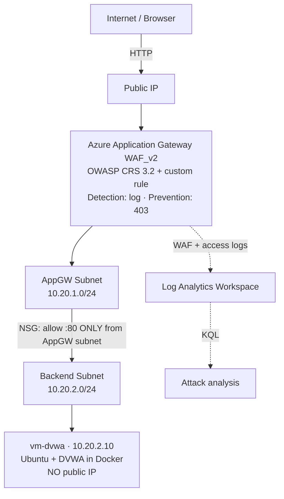

The vulnerable host has **no public IP**. The only network path to it is port 80 from the gateway's subnet, enforced by an NSG. The WAF is one layer of defense; the network isolation is a second, independent one.

---

## Tech Stack

| Component | Detail |
|---|---|
| IaC | Terraform, `azurerm ~> 4.0`, remote state in shared Azure backend |
| Edge / WAF | Azure Application Gateway **WAF_v2**, OWASP CRS 3.2 |
| Compute | Ubuntu 22.04 VM running DVWA in Docker via cloud-init |
| Network | VNet with isolated AppGW and backend subnets, backend NSG |
| Logging | Diagnostic settings → Log Analytics workspace, queried with KQL |
| Region | East US |

---

## What Was Built

The entire environment is defined in Terraform. Key design decisions:

- **Standalone WAF policy** (`azurerm_web_application_firewall_policy`) attached to the gateway by `firewall_policy_id`, rather than the deprecated inline `waf_configuration` block. The policy has its own lifecycle, so rules and modes can change without touching the gateway.
- **Backend NSG** allowing port 80 only from the AppGW subnet (`10.20.1.0/24`), with an explicit deny-all. The DVWA VM has no public IP and no inbound SSH.
- **Capacity fixed at 1, no autoscaling** — WAF_v2 is the most expensive resource in the lab, and autoscaling is the most common cause of surprise cost.
- **Remote state with a per-lab key** (`lab03-webapp.tfstate`) to isolate blast radius across the portfolio.
- **Secrets discipline** — no credentials in committed code; `terraform.tfvars` is gitignored, with a committed `terraform.tfvars.example` using RFC-5737 placeholder values.

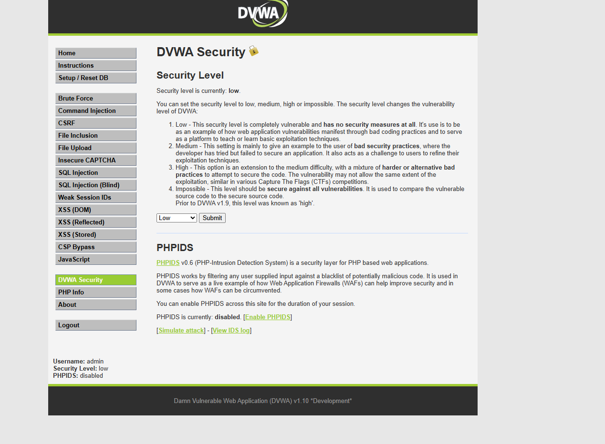

---

## Part 1 — Attacks in Detection Mode

The WAF was started in **Detection mode**: it logs every rule match but still forwards the request. This establishes a baseline — every attack below *succeeds* against the app while the WAF watches.

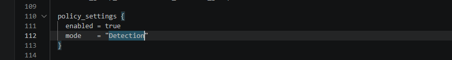

### SQL Injection

The classic logic bypass `' OR '1'='1` returns every user instead of one, because the always-true condition matches all rows.

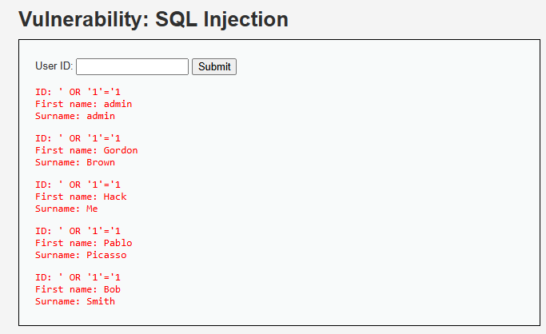

A UNION query (`' UNION SELECT user, password FROM users-- -`) then exfiltrates every username and its MD5 password hash. Two columns, because the page returns two columns and a UNION must match.

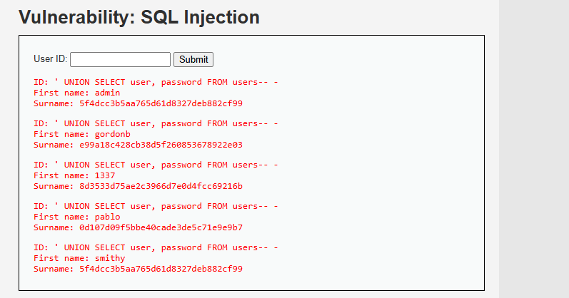

### Stored XSS

An injected `<script>` tag is persisted to the database and runs in every visitor's browser. Here it reads and displays the session cookie — a stand-in for silent session theft. (Landing the payload required defeating a client-side `maxlength` limit, which is itself the lesson: client-side input limits are not a security control.)

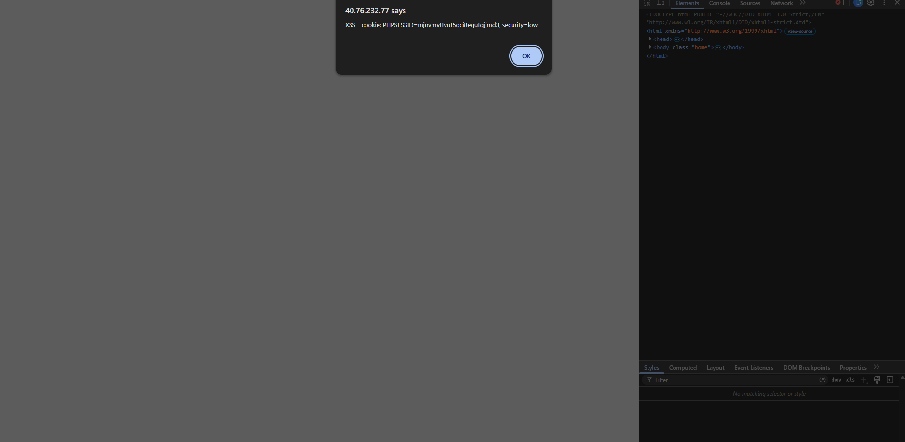

### Command Injection

Appending `; cat /etc/passwd` to the ping field chains a second OS command. The server runs both and returns the full system account list — arbitrary command execution on the host.

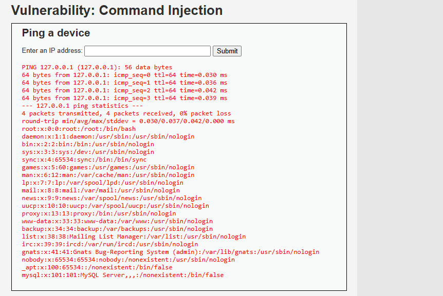

### CSRF

A crafted password-change URL succeeds simply by arriving with the victim's session cookie. There is no anti-CSRF token at this security level, so the server cannot distinguish a forged request from a legitimate one.

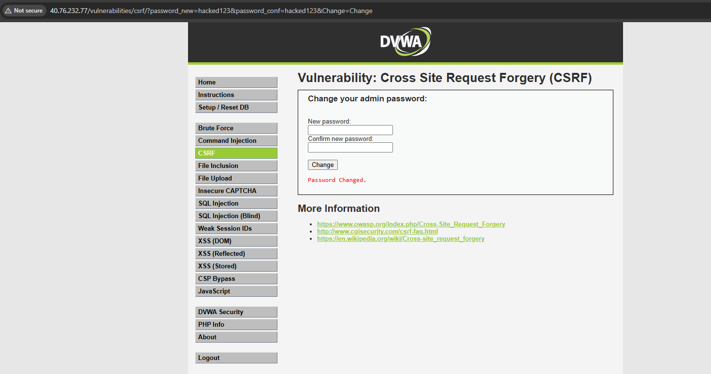

---

## Part 2 — Tune a False Positive, Then Enforce

You never flip a WAF straight to blocking. Running in Detection surfaced a **false positive**: rule **920350** ("Host header is a numeric IP address") fired repeatedly on legitimate traffic — because the lab is accessed by IP, not a hostname. Enforcing without tuning would have 403'd every page load.

The fix was the **narrowest possible exception** — disabling only rule 920350 via a `rule_group_override`, leaving every other rule active.

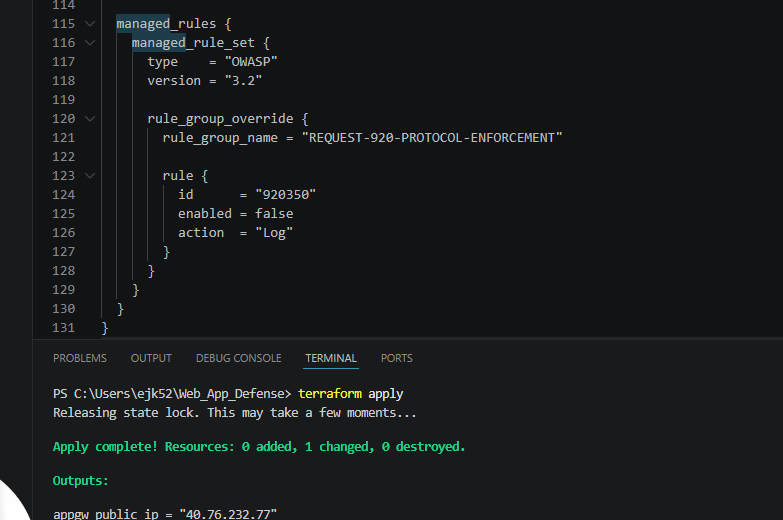

> In production the better fix would be to put a real hostname in front and leave the rule enabled. Disabling it is correct only because this is an IP-accessed lab.

With the false positive tuned out, the policy was switched to **Prevention**.

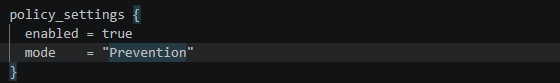

### Re-running the attacks under Prevention

The three payload-based attacks are now blocked at the gateway with **403 Forbidden** — the request never reaches DVWA.

| Attack | Result |
|---|---|
| SQL Injection | 403 Forbidden |
| Stored XSS | 403 Forbidden |
| Command Injection | 403 Forbidden |
| CSRF | **Still succeeds** |


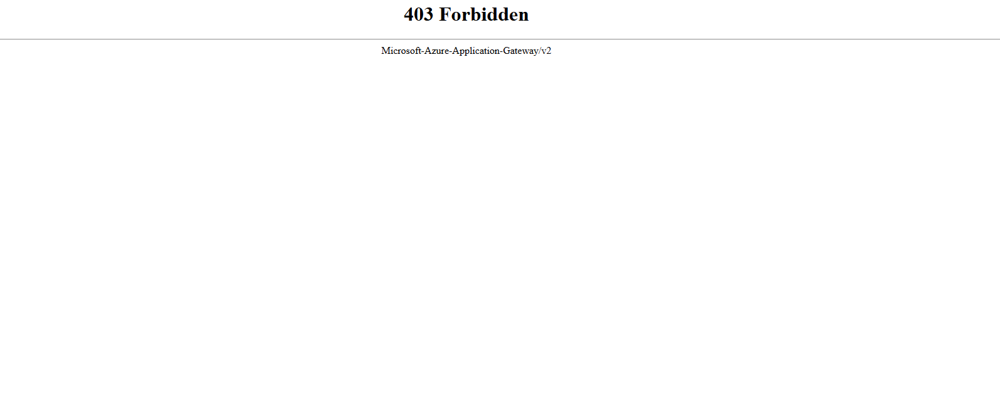


**The key result:** CSRF still goes through. The password change succeeds even with the WAF enforcing.

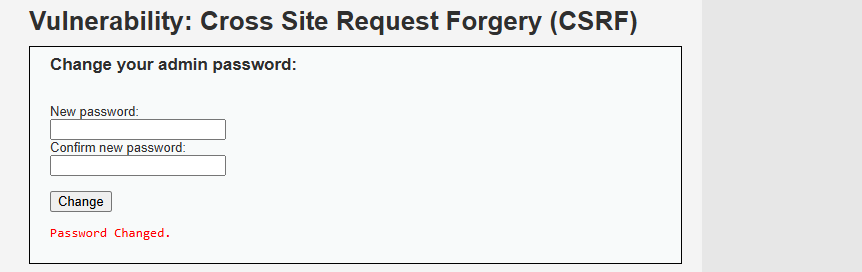

SQLi, XSS, and command injection each carry a recognizable malicious payload (`UNION SELECT`, `<script>`, `; cat`) that a signature-based WAF can match. **CSRF carries no malicious payload** — every value looks legitimate. The attack is about missing intent verification, not bad input, so there is nothing for the WAF to match. This is the limit of a WAF: it is a strong layer against known attack patterns, but it cannot replace application-layer fixes (anti-CSRF tokens, `SameSite` cookies).

---

## Part 3 — Custom WAF Rule

Managed OWASP rules cover generic attacks; custom rules encode organization-specific policy. This rule blocks any request whose query string contains an internal application name, simulating prevention of internal-identifier exposure.

Design choices: **priority 1** so it evaluates ahead of the managed rules, and a **lowercase transform** so it cannot be evaded by changing case.

A request with the blocked pattern returns 403:

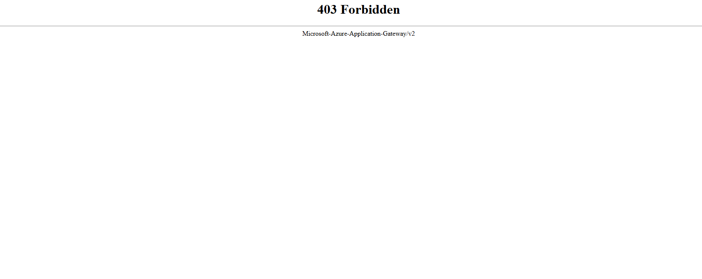

The same page without the pattern loads normally, proving the rule is scoped and does not block legitimate traffic:

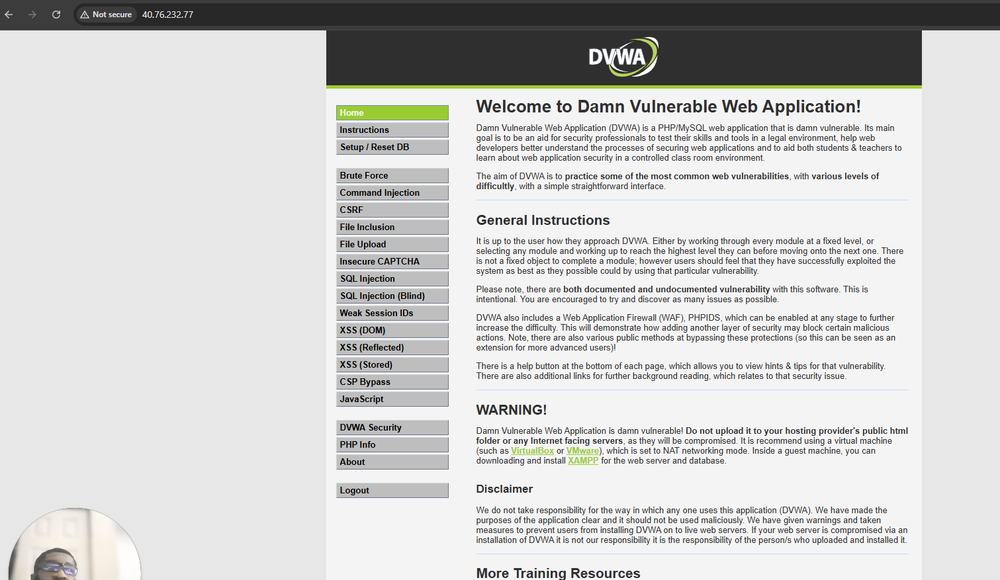

---

## Part 4 — Log Analysis with KQL

All WAF and access events flow to Log Analytics. The raw event feed shows each attack by its request URI, with a mix of `Matched` and `Blocked` actions.

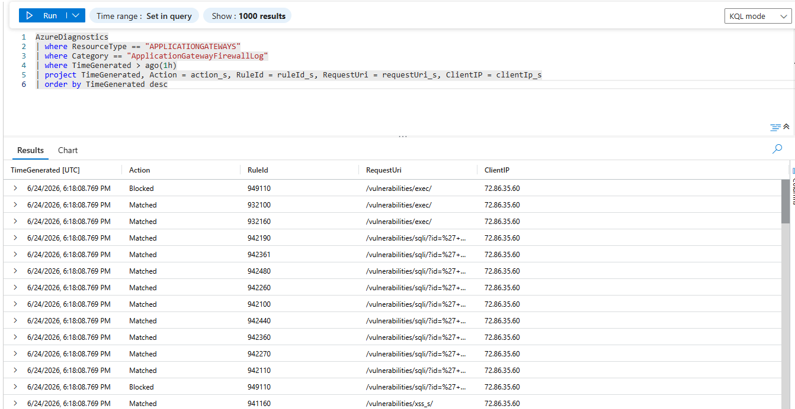

**Why the mix of Matched and Blocked:** OWASP CRS 3.x uses **anomaly scoring**. Individual rules contribute to a score, and rule **949110** is the evaluator that blocks once the cumulative score crosses a threshold. So one malicious request produces several `Matched` entries (the contributing rules) and one `Blocked` entry (the decision).

Aggregating the blocks shows both WAF layers working together — the managed evaluator (949110) and the hand-written custom rule (`blockInternalName`):

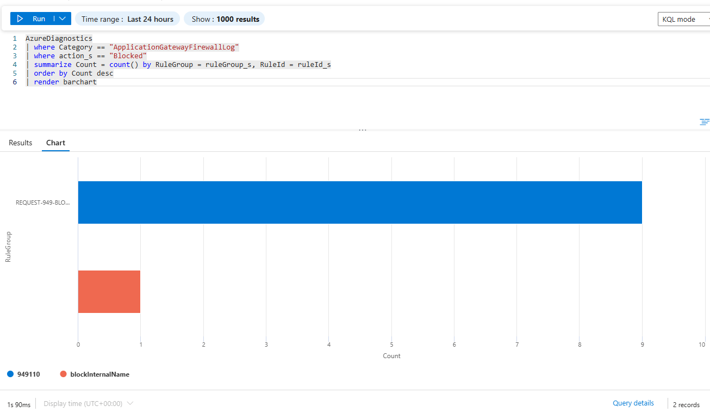

Pivoting to source IP shows where blocked requests originated — in a real incident, the basis for blocking at the perimeter or feeding threat intelligence:

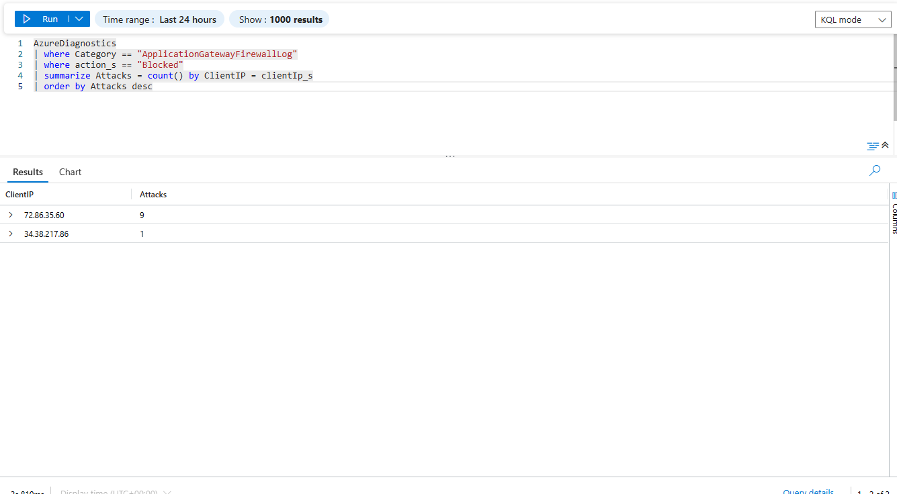

---

## Key Learnings

- **Defense in depth** — the vulnerable host was isolated at the network layer (private IP, NSG allowing only the gateway), so even full command execution is bounded by the architecture. The WAF is one control, not the only one.
- **Detection → tune → Prevention** — enforcing a WAF without first tuning false positives breaks legitimate traffic. A real false positive (rule 920350) was found and fixed with the narrowest scope before enforcing.
- **WAF limits** — signature-based filtering blocks recognizable malicious payloads (SQLi, XSS, RCE) but cannot stop CSRF, which has no payload. Application-layer defenses are required.
- **Anomaly scoring** — CRS 3.x blocks on a cumulative score (rule 949110), not per individual match, which explains the log structure.
- **Local vs server-side validation** — `terraform validate` checks HCL syntax, but Azure enforces additional constraints only on apply (password complexity, alphanumeric custom-rule names, regional SKU availability).
- **Cost discipline** — WAF_v2 bills continuously; capacity was fixed at 1 with no autoscaling, and the environment was destroyed after each session.

---

## Troubleshooting

| Issue | Cause | Resolution |
|---|---|---|
| `terraform validate` passes but `apply` fails on password | Azure enforces VM password complexity (3 of 4 char classes, 12–72 chars) server-side | Set a compliant password in `terraform.tfvars` |
| `metric` block deprecation warning | `metric {}` renamed to `enabled_metric {}` in azurerm 4.x | Renamed the block |
| `SkuNotAvailable: Standard_B1s ... Capacity Restrictions` in East US | Regional SKU capacity varies by day | Checked `az vm list-skus` and switched to an available SKU (D2ls_v7) |
| Single-line block error in `variables.tf` | HCL single-line blocks allow only one argument | Expanded multi-argument blocks across lines |
| `Custom Rule ... does not have valid name` (400) | Azure requires alphanumeric custom-rule names | Renamed `block-internal-name` → `blockInternalName` |
| Stored XSS payload saved blank | Client-side `maxlength` truncated the `<script>` tag | Removed `maxlength` via dev tools / console before submitting |
| Rule 920350 firing on legitimate traffic | CRS flags numeric-IP Host headers; lab is accessed by IP | Disabled only rule 920350 via `rule_group_override` |
| 502 Bad Gateway right after deploy | cloud-init still pulling the DVWA container; backend probe not healthy yet | Wait 1–2 minutes and refresh |
| Empty KQL results | Log Analytics ingestion lag | Wait 3–5 minutes after generating traffic |

---

## Deployment

```bash
# Configure your values
cp terraform.tfvars.example terraform.tfvars   # then edit

# Deploy (Application Gateway takes ~6–8 minutes)
terraform init
terraform plan
terraform apply

# Browse to the gateway IP, log into DVWA (admin/password),
# Create/Reset Database, set DVWA Security to Low.

# Tear down when finished — WAF_v2 bills continuously
terraform destroy
```

> **Cost warning:** Application Gateway WAF_v2 carries a fixed hourly charge plus a Capacity Unit charge even while idle (~$8–9/day if left running). Run the lab in one sitting and destroy immediately after.

---

## Repository Layout

```
.
├── backend.tf                  # provider + remote state (per-lab key)
├── variables.tf                # input variables (fail-loud, no defaults on secrets)
├── main.tf                     # all resources: network, NSG, VM, WAF policy, gateway, diagnostics
├── terraform.tfvars.example    # placeholder values (committed)
├── terraform.tfvars            # real values (gitignored)
├── .gitignore
├── README.md
└── screenshot/
```
